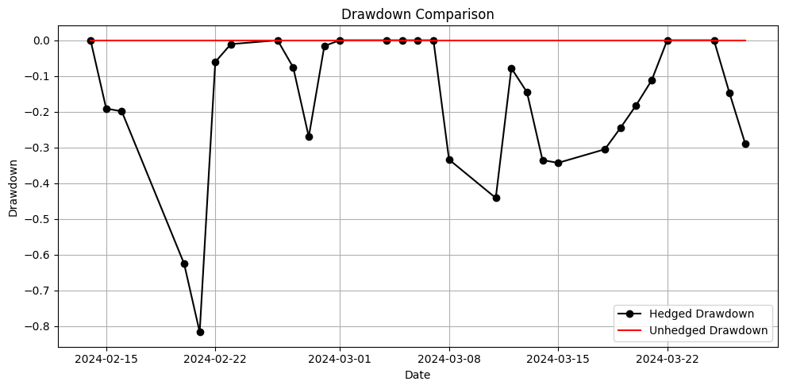
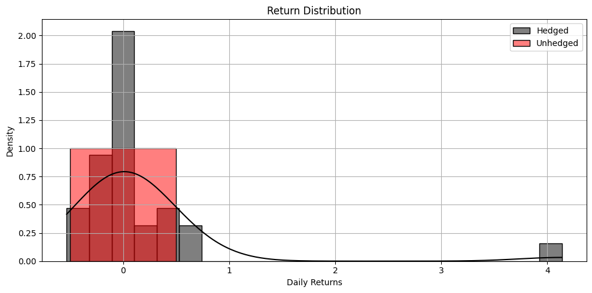
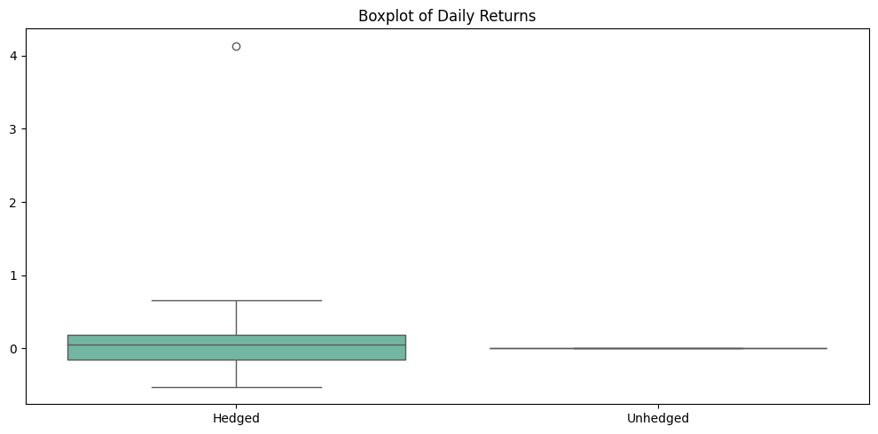

# Pricing and Risk Analysis of Equity Options Using the Black-Scholes Model and Option Greeks

This project explores a delta hedging strategy using European call options on NVIDIA (NVDA), utilizing the Black-Scholes Model (BSM) and Greek sensitivities. We simulate and backtest a dynamic delta-hedged portfolio and compare its risk profile to an unhedged position.

---

## 📌 Objectives

- Retrieve NVDA options and historical stock data using `yfinance`.
- Calculate theoretical option prices using the **Black-Scholes Model**.
- Estimate option **Greeks**: Delta, Gamma, Theta, Vega.
- Analyze the behavior of Greeks with respect to strike prices.
- Implement a **Delta Hedging Strategy**: Shorting ATM calls and buying shares.
- **Backtest** the strategy over 30 trading days.
- Evaluate performance: portfolio value, PnL, risk metrics (Std Dev, VaR, Max Drawdown).
- Visualize results with detailed plots and interpretation.

---

## 🛠️ Technologies Used

- Python 🐍
- `yfinance`, `numpy`, `pandas`
- `matplotlib`, `seaborn`
- Black-Scholes Model
- Option Greeks Formulas

---

## 📦 Project Structure

---

## 📈 Option Greeks Visualization

Visualizing how Delta, Gamma, Theta, and Vega change with respect to strike prices for both call and put options:

- **Delta**: ~0.5 for ATM calls, ~-0.5 for ATM puts  
- **Gamma**: Bell-shaped, peaking near ATM  
- **Theta**: Negative, call options decay faster than puts  
- **Vega**: Highest for ATM options  

---

## 🔧 Strategy Setup

We **short an ATM call option** and **buy delta shares** of NVDA to hedge exposure.

Key Variables:

- `S0`: Current spot price of NVDA  
- `K`: Strike price of ATM call  
- `Delta`: Option sensitivity to underlying  
- `Call Premium`: Collected as upfront cash  
- `Rebalancing`: Daily update of delta and shares  

---

## Greeks

---

## ⏱️ Backtesting Results

Backtested over a 30-day window using rolling volatility estimates.

### 📊 Portfolio Value Over Time

---

### 📉 Drawdown Comparison

The delta-hedged portfolio experiences temporary losses due to path-dependent risks (gamma), but overall reduces directional risk.

---

### 📊 Return Distribution

Hedged returns have **lower variance** and **higher kurtosis** compared to unhedged.

---

### 📦 Boxplot of Daily Returns

Delta hedging significantly reduces the spread of returns.

## 🧠 Insights

- Delta hedging reduces **volatility** and **directional risk**, but not **path-dependent risk** like Gamma.  
- Proper rebalancing is crucial as Delta changes over time.  
- Unhedged short call positions may offer premium income but expose to unlimited losses.  
- Delta-hedged positions may underperform in a trending market but reduce extreme risks.  

## 📬 Future Work

- Add Gamma/Vega hedging using options spreads.  
- Incorporate real market bid-ask spreads and slippage.  
- Extend to multi-asset or long-short option strategies.  
- Use implied volatility surfaces for more realistic modeling.  

## 📜 License

This project is for educational and research purposes only. Not financial advice.
